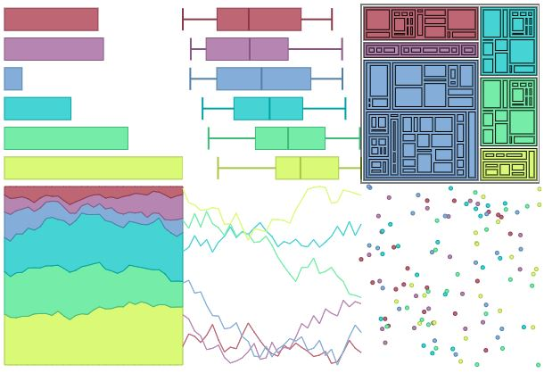

# Awesome Dataviz Color 
> A curated list of awesome articles and librairies about color in data visualization.

Color scheme picking is not a trivial choice. One has to take into account accessiblity, readability, context and emotions. This awesome list should answer every questions you may have on this topic.

- [Guides](#guides)
  * [General](#general)
  * [Tutorials](#tutorials)
  * [Color Theory](#color-theory)
- [Tools](#tools)
  * [Online](#online)
  * [R](#r)
  * [Python](#python)
  * [Julia](#julia)
  * [Javascript](#javascript)
  * [Stata](#stata)

## Guides

### General
- [Color for Data Visualization](https://www.slideshare.net/mikamiks1/color-for-data-visualization)
- [How to choose the colors for your data visualizations](https://medium.com/nightingale/how-to-choose-the-colors-for-your-data-visualizations-50b2557fa335)
- [What to consider when choosing colors for data visualization](https://blog.datawrapper.de/colors/)
- [Introduction to Color Theory and Color Palettes](https://careerfoundry.com/en/blog/ui-design/introduction-to-color-theory-and-color-palettes/)

### Tutorials
- [An Alternative to Pink and Blue: Colors for Gender Data](https://blog.datawrapper.de/gendercolor/)
- [Finding the right color palettes for data visualizations](https://blog.graphiq.com/finding-the-right-color-palettes-for-data-visualizations-fcd4e707a283)
- [Exploring a tetrad color harmony with Paletton.com and Viz Palette](https://medium.com/nightingale/double-complements-for-a-visualization-27f9f377794e)
- [Which is the best way to generate random colors?](https://medialab.github.io/iwanthue/theory/)

### Color Theory
- [Subleties of color](https://earthobservatory.nasa.gov/blogs/elegantfigures/2013/08/05/subtleties-of-color-part-1-of-6/) - A 6 parts guide written by [Robert Simmon](https://en.wikipedia.org/wiki/Robert_Simmon)
- [Introduction to Color Theory](https://www.tigercolor.com/color-lab/color-theory/color-theory-intro.htm)
- [How To Avoid Equidistant HSV Colors](https://www.vis4.net/blog/2011/12/avoid-equidistant-hsv-colors/)
- [Color Spaces](https://ciechanow.ski/color-spaces/) - An interactive article about RGB & color spaces.
- [Why HCL color space?](http://hclwizard.org/why-hcl/)
- [From Hexcodes to Eyeballs](http://jamie-wong.com/post/color/) - A deep adventure from Hexcode to perceived color.
- [Color Theory](https://www.handprint.com/HP/WCL/wcolor.html) - Description speaks for itself:
    > Here is the most comprehensive discussion for artists of color perception, color psychology, "color theory" and color mixing available online, and one of the most comprehensive available anywhere in any format.

## Tools

### Online
- [ColorBrewer](https://colorbrewer2.org/) - A very popular, easy to use, automatic palette generator.
- [I Want Hue](https://medialab.github.io/iwanthue/) - Palette generator based on HCL color space.
- [HCL-picker](http://tristen.ca/hcl-picker) - Palette generator based on HCL color space.
- [Paletton](http://paletton.com) - Advanced palette generator with few automations.
- [HCL Wizard](http://hclwizard.org:64230/hclwizard/) - Palette generator based on colorspace library.
- [Palette Visualizer](https://projects.susielu.com/viz-palette) - Try your palette effectiveness and simulate for colorblinds.
- [Colot Thief](https://lokeshdhakar.com/projects/color-thief) - Extract palette from images.
- [Scientific Colour Maps](http://www.fabiocrameri.ch/colourmaps.php) - Curated list of palettes.

### R
- [Colorspace](http://colorspace.r-forge.r-project.org/index.html) - Toolbox for selecting individual colors or color palettes.
- [Viridis](https://cran.r-project.org/web/packages/viridis/vignettes/intro-to-viridis.html) - Matplotlib color scales in R.

### Python
- [Colorspace](https://python-colorspace.readthedocs.io/en/stable/index.html) - Toolbox for selecting individual colors or color palettes.
- [Colorcet](https://colorcet.holoviz.org/) - Collection of perceptually accurate colormaps.

### Julia
- [ColorSchemes.jl](https://juliagraphics.github.io/ColorSchemes.jl/stable/) - Collection of colorschemes.
- [Colors.jl](http://juliagraphics.github.io/Colors.jl/stable/) -  Wide array of functions for dealing with color.
- [Perceptual Colour Maps](https://github.com/peterkovesi/PerceptualColourMaps.jl) - Functions for creating high quality colour maps.

### Javascript
- [Chroma.js](https://gka.github.io/chroma.js) - An advanced library for color scales, conversions and palette generations.
- [d3-color](https://github.com/d3/d3-color) - Low level library to manipulate color with D3
- [scale-color-perceptual](https://github.com/politiken-journalism/scale-color-perceptual) - Javascript exports of matplotlib's color scales.

### Stata
- [Palettes](http://repec.sowi.unibe.ch/stata/palettes/index.html) - Color palettes, symbol palettes, and line pattern palettes.
